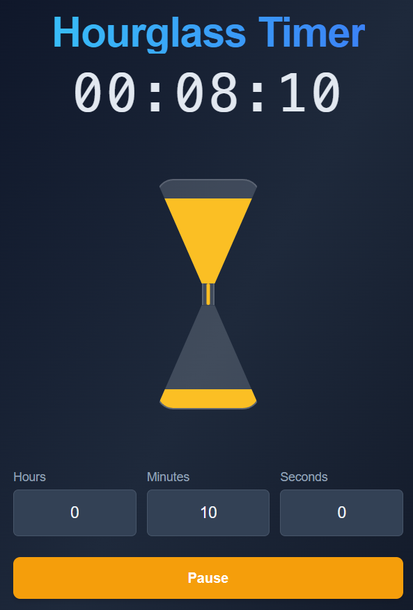

A timer with a visual hourglass display, done in TypeScript

## Run Locally

**Prerequisites:**  Node.js

1. Install dependencies:
   `npm install`
2. Run the app:
   `npm run dev`
3. Build the app:
   `npm run build`